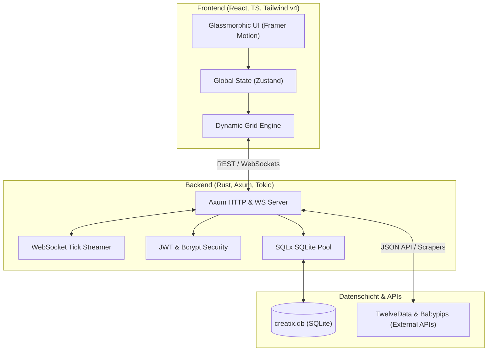

# 🌌 Creatix Trading Terminal

[](https://opensource.org/licenses/MIT)
[](https://www.rust-lang.org/)
[](https://react.dev/)
[](https://playwright.dev/)

!!! This Project is still under development and has still some bugs and unfinished features !!!

Ein hochmodernes, performantes und voll personalisierbares Trading-Terminal sowie Journaling-Suite zur Professionalisierung des privaten Tradings. **Creatix** kombiniert Echtzeit-Marktdatenanalyse, ein hochgradig modulares Widget-Raster-System, risikobewusstes Journaling und verhaltensanalytische Metriken in einer eleganten, glassmorphischen Benutzeroberfläche.

---

## 🎯 Vision & Ziele

Creatix wurde entwickelt, um zwei der größten Probleme im modernen Retail-Trading zu lösen: **Datenfragmentierung** und **mangelnde emotionale Disziplin**.

*   **Zusammenführung aller Datenströme**: Marktdaten, Wirtschaftsereignisse, historische Trades, statistische Korrelationen und persönliche Journal-Einträge existieren nicht mehr isoliert, sondern fließen in einem zentralen Dashboard zusammen.
*   **Risiko- und Emotionskontrolle**: Ein integrierter "Drawdown Protector" und hochentwickelte psychologische Metriken (wie der *Creatix Score*) helfen Tradern, emotionale Tiefs und fehlerhafte Verhaltensmuster proaktiv zu erkennen und zu unterbinden.
*   **Volle Personalisierbarkeit**: Jedes Trading-Setup ist einzigartig. Durch das fortschrittliche Drag-and-Drop-Widget-System können Trader ihr Dashboard exakt auf ihre Strategien zuschneiden.

---

## 🛠️ Framework & Technologie-Stack

Creatix setzt auf eine moderne, strikt getrennte Client-Server-Architektur, um maximale Geschwindigkeit und Zuverlässigkeit zu garantieren.



### 💻 Frontend (Client)
*   **React 18 & TypeScript**: Typensichere und deklarative UI-Entwicklung.
*   **Vite 5**: Ultraschneller Entwicklungs-Server und optimierter Production-Build.
*   **Tailwind CSS 4 & PostCSS**: Modernste CSS-Styling-Engine für performante, responsive und wunderschöne HSL-Tailored Dark Mode Themes.
*   **Framer Motion**: Flüssige Micro-Animations und hochentwickelte visuelle Übergänge für ein erstklassiges Premium-Erlebnis.
*   **Zustand**: Minimalistisches und blitzschnelles globales Zustandsmanagement.
*   **Lucide React**: Konsistentes und hochauflösendes Icon-System.

### ⚙️ Backend (Server)
*   **Rust (Edition 2021)**: Extrem speichereffizient, absolut threadsicher und blitzschnell.
*   **Axum & Tokio**: Asynchroner High-Performance-Webserver für REST-APIs und latenzarme WebSocket-Verbindungen.
*   **SQLx**: Vollständig asynchrone Datenbankabfragen mit SQLite über Compile-Time-geprüfte SQL-Statements und Connection Pooling.
*   **JSON Web Tokens (JWT) & Bcrypt**: Sichere, tokenbasierte Benutzerauthentifizierung und Passwortverschlüsselung.

---

## 📁 Repository-Struktur

Das Repository wurde sorgfältig strukturiert und bereinigt, um einen sauberen und professionellen Open-Source-Release zu gewährleisten:

```
Creatix/
├── backend/                   # ⚙️ Rust Axum Backend
│   ├── src/                   # Quellcode (Hauptserver, API-Routen, WebSocket, DB-Handler)
│   ├── scripts/               # Hilfsscripte für lokale Tests und Schema-Analysen
│   ├── Cargo.toml             # Rust Abhängigkeiten & Build-Konfiguration
│   └── Cargo.lock
├── frontend/                  # 💻 React + Vite + Tailwind v4 Frontend
│   ├── src/                   # React Quellcode (Seiten, Komponenten, UI, Store, Hooks)
│   ├── public/                # Statische Assets und Widget-Templates
│   ├── tsconfig.json          # TypeScript Konfiguration
│   └── vite.config.ts         # Vite Bundler Konfiguration
├── examples/                  # 💡 Referenzprojekte und Prototypen
│   └── widget-grid-prototype/ # HTML/JS-Prototyp des Widget-Grid-Systems (Cleaned)
├── resources/                 # 📊 Analyse-Ressourcen, Excel-Templates und Korrelationsmatrizen
├── scripts/                   # 🛠️ Globale Administrations- und Automatisierungstools
│   ├── db/                    # DB-Initialisierung, Testdaten-Seeding, Migrationen
│   ├── data_extraction/       # Wirtschaftsdaten-Scraper und Excel-Parser
│   └── simulation/            # Benutzer- und Aktivitätstracking-Simulatoren
├── tests/                     # 🧪 End-to-End Playwright Integrations- & Regressionstests
├── .gitignore                 # Bereinigte Ausschlussregeln für Git (keine temporären Logs/Datenbanken)
├── package.json               # Globale Workspace-Scripts & Playwright E2E-Abhängigkeiten
└── README.md                  # Dieses Dokument
```

---

## 🚀 Erste Schritte / Installation

### Systemvoraussetzungen
Stelle sicher, dass folgende Software auf deinem System installiert ist:
*   **Rust Toolchain** (Version `1.75` oder neuer empfohlen) -> [Rust installieren](https://www.rust-lang.org/tools/install)
*   **Node.js** (Version `18.x` oder neuer) & **npm** -> [Node.js installieren](https://nodejs.org/)

---

### Schritt-für-Schritt Startanleitung

#### 1. Repository klonen
```bash
git clone https://github.com/YourUsername/Creatix.git
cd Creatix
```

#### 2. Backend starten
Verschiebe dich in das Backend-Verzeichnis und starte den Rust-Server. Beim ersten Start wird die Datenbank `creatix.db` im Backend-Ordner automatisch initialisiert und mit Standardwerten gefüllt.

```bash
cd backend
# Erstelle deine .env-Datei basierend auf .env.example (falls vorhanden)
cargo run
```
*Das Backend läuft standardmäßig auf `http://localhost:3001`.*

#### 3. Frontend starten
Öffne ein neues Terminalfenster, wechsle in das Frontend-Verzeichnis, installiere die npm-Abhängigkeiten und starte den Vite-Entwicklungsserver.

```bash
cd frontend
npm install
npm run dev
```
*Das Frontend öffnet sich automatisch unter `http://localhost:5173/`.*

#### 4. (Optional) End-to-End Tests ausführen
Um die Integrität der Benutzeroberfläche und die API-Kompatibilität zu validieren, kannst du die Playwright-Tests vom Root-Verzeichnis aus ausführen:

```bash
# Im Root-Verzeichnis des Projekts
npm install
npx playwright test
```

---

## 🛣️ Roadmap & Zukünftige Erweiterungen

Creatix befindet sich in stetiger Weiterentwicklung. Folgende Meilensteine sind für zukünftige Releases geplant:

### 🔹 Phase 1: Broker-Integrationen & Live-Execution
*   **Interactive Brokers & MetaTrader 5 APIs**: Direkte Anbindung zur automatischen Synchronisation von Live-Trades und Ausführungen ohne manuellen Import.
*   **Binance & Coinbase WebSockets**: Live-Tick-Daten-Streaming für Krypto-Märkte direkt im Terminal.

### 🔹 Phase 2: Fortgeschrittene quantitative Verhaltensanalyse
*   **AI Trading Mentor**: Ein lokal laufendes LLM (oder via API), das deine Journal-Einträge liest, dein Trading-Verhalten analysiert und personalisierte Ratschläge zur Disziplinverbesserung erteilt.
*   **Advanced Risk Analytics**: Automatische Berechnung von Sharpe Ratio, Sortino Ratio und maximalem Drawdown in Echtzeit direkt im Dashboard.

### 🔹 Phase 3: Strategie-Backtesting & Portfolio-Optimierer
*   **Multi-Asset-Backtester**: Teste deine Trading-Regeln anhand historischer Daten direkt im Terminal mit interaktiven Equity-Kurven.
*   **Kovarianz-Portfolio-Optimierung**: Ein mathematisches Tool, das basierend auf den aktuellen Marktkorrelationen die optimale Positionsgröße für deine Trades vorschlägt.

---

## ⚖️ Lizenz

Dieses Projekt ist unter der **MIT-Lizenz** lizenziert. Weitere Details findest du in der [LICENSE](LICENSE)-Datei (falls vorhanden) oder unter [opensource.org/licenses/MIT](https://opensource.org/licenses/MIT).

---

*Entwickelt mit ❤️ für anspruchsvolle Trader, die datengetriebene Disziplin schätzen.*
